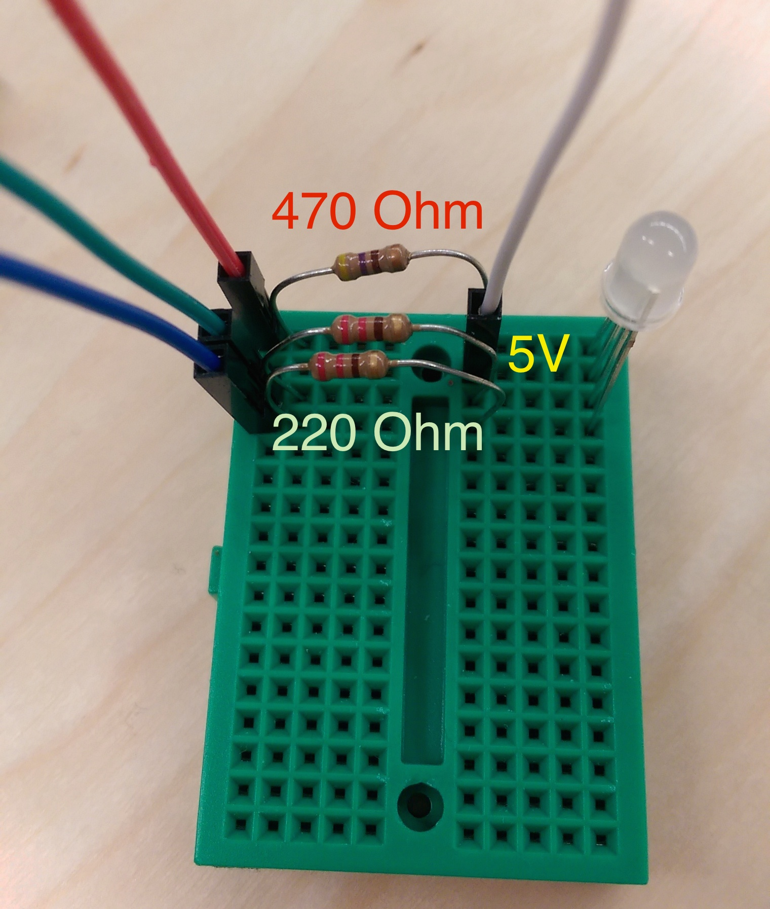

## DIY Hue Light with Android Interface

IoT devices are expensive, the smart home is not going to be cheap. That's why we become developers and save loads of money by building instead of buying those quirky devices everyone _needs_.

I am going to walk you through creating your own Hue light with an Android interface. Before we proceed, I recommend you take a look at the [other Raspberry Pi tutorials][RPi Blogs] that PubNub offers. This blog post assumes that you have your Raspberry Pi setup and have the PubNub Python SDK installed. If you do not, check out [RaspberryPi 101](https://www.pubnub.com/blog/internet-of-things-101-getting-started-w-raspberry-pi/) to catch up. If you have your Pi OS up and running, use [this tutorial][RPi Setup] which just gets the PubNub Python SDK installed on your device.

### Required Hardware
- Raspberry Pi
- Breadboard
- RGB LED Light*
- 3 (~330 Ohm) Resistors
- 4 Male/Female Wires

*_Not all LEDs are the same, see Part 1_

### Part 1. Intro to RGB

__Not all RGB LEDs are created equal. They can have a shared cathode, or shared anode.__


In the common cathode LED, if only the R pin goes high, the light will show red. However, in the common anode LED, if only the R pin goes high, the light will show Cyan. For those of you who skipped that day of middle school art class, green and blue light together make cyan.

__This tutorial will be written for an RGB LED using a common anode. I will point out the blocks of code that will need to be different when using a common cathode. Read about your LED before proceeding.__

### Part 2. The Setup

#### 2.1 GPIO Pin Selection

I built my PHue using the RaspberryPi Model B+. You will have to find which pins you want to use, as well as which pin is the 5V power source. If you are using the Model B+ or Model B, you can mimic the picture.


You will need to select 3 GPIO pins. Write down the numbers of the pins you select, we will need them in the next step. In this photo, and for the rest of the demo, I will use colored wires that correspond to the same RGB values on the LED (red wire goes to the pin on the LED corresponding with red). The white wire, __in this tutorial__, is connected to the 5V power supply. If you are using a __common cathode__ the white wire should go to Ground. Connect the female ends of your Male/Female wires to the pins you selected.

#### 2.2 Breadboard Setup

Now you have your GPIO pins and 5V power source selected and connected. Time to set up the breadboard.



Refer to the RGB LED diagram above again. Notice that the longest wire gets the 5V. You can tell which pin is red since it is on the side of that long pin that only has one pin, not two. From there you can figure out green and blue, they are on the other side of the long pin. In the photo above, the long pin is in the second row from the top, with the white wire.

Time for the resistors. I said you will need ~300 Ohms, but notice that I use two different resistors. You can play around with what combination works best for you, but as a rule of thumb, the red light tends to overpower the green and blue, so I put a stronger resistor to reduce the current it receives. When we get our light on in the next step, I will show you how to set it to white. If you notice that the "white" looks a little red, you can change the resistor then.

Regardless of a common anode or cathode RGB, you can set up the breadboard exactly as it appears in this photo. The only difference would be what the female end of the white wire is connected to. 

### Part 3. The Raspberry Pi Code

PubNub offers a [C/C++ library][C/C++] and a [Python library][Python] to use on Raspberry Pi. I implemented this tutorial in Python. If you missed my earlier advice and still need to install the PubNub Python SDK on your Pi, use [this tutorial][RPi Setup]. If you're ready, then let's get started!

#### 3.1 Imports and Pin Setup

```
#!/usr/bin/python

import time
import RPi.GPIO as GPIO
from Pubnub import Pubnub  
```
These are all the imports you will need. [RPi.GPIO](https://pypi.python.org/pypi/RPi.GPIO) allows you to map the pins on your Pi. We will use time and Pubnub. Time to coordinate color changes in our LED, and Pubnub to stream color values to your PHue light. 

Remember those pin assignments you wrote down earlier, now we need them.

```
## Make your pin assignments
red_gpio   = 18
green_gpio = 23
blue_gpio  = 24
```
Then we will instantiate our pins using the function `GPIO.setup`. We need to declare the General Purpose Input/Output pins as either an input or an output.

```
## Setup GPIO Board and Pins
GPIO.setmode(GPIO.BCM)    # BCM for GPIO numbering  
GPIO.setup(red_gpio,   GPIO.OUT)
GPIO.setup(green_gpio, GPIO.OUT)
GPIO.setup(blue_gpio,  GPIO.OUT)
```

The `GPIO.setmode` function tells python what pin numbering system is being used. See [this thread](https://www.raspberrypi.org/forums/viewtopic.php?f=32&t=34273) for a brief description of the options. The GPIO diagram I used to select pin numberings used the BCM channel design. If you later have issues with this portion, try using the GPIO.BOARD option. `GPIO.setup` is where we declare the pins as input or output. The other option is of course `GPIO.IN` which is used when something like a sensor is returning data to the Pi.

```
## Init the GPIO PWMs
Freq  = 100 #Hz

RED   = GPIO.PWM(red_gpio, Freq)
RED.start(0)

GREEN = GPIO.PWM(green_gpio, Freq)
GREEN.start(0)

BLUE  = GPIO.PWM(blue_gpio, Freq)
BLUE.start(0)
```

This code is used for setting up your pins using [Pulse Width Modulation](http://en.wikipedia.org/wiki/Pulse-width_modulation).  PWM is a method for generating an analog signal using a digital source. It encodes a message into a pulsing signal. The "message" in this case, is the RGB values that each of our pins will be sending to the LED. If you are interested you can read more about PWMs [here](http://digital.ni.com/public.nsf/allkb/294E67623752656686256DB800508989).

#### 3.2 The Lighting Code

These pulsing values (on-time and off-time) are called a PWMs [Duty Cycle](http://en.wikipedia.org/wiki/Duty_cycle), so the Python function we will be using to set RGB values is `<COLOR>.ChangeDutyCycle(<value>)`.

```
# Update the hue with R G B values
def updateHue(R, G, B):
	rVal = 100 - (R/255.0)*100	# Will have to change these values depending on
	gVal = 100 - (G/255.0)*100	#  whether your LED has a common cathode or common
	bVal = 100 - (B/255.0)*100	#  anode. This code is for common anode.
	print "rgb(%.2f, %.2f, %.2f)" % (rVal, gVal, bVal)
	RED.ChangeDutyCycle(rVal)
	GREEN.ChangeDutyCycle(gVal)
	BLUE.ChangeDutyCycle(bVal)
```

Since our PWM is pulsing at 100Hz, we must give it a value between 0.0 and 100.0 for its Duty Cycle. 100.0 means the pin always stays high, 0.0 means it always stays low. As anyone who has worked with CSS knows, color values are often represented by 6-digit Hex values. To fit RGB values into 6 digits of hex, each color actually has `2^8 = 256` possible choices (0-255). That said, we now need to find the proportional value of our desired RGB out of 100. For example, a given R value out of 100 is `(R/255.0)*100`.

__This part is especially different for common anode and common cathode LEDs!__

If you are using a common cathode (meaning the long pin is connected to Ground), you should use the code `rVal = (R/255.0)*100`. However, if you are using a common anode (5V to long pin), like me, you will need to use `rVal = 100 - (R/255.0)*100`

```
rVal = (R/255.0)*100			# Common Cathode (Ground)
rVal = 100 - (R/255.0)*100		# Common Anode (5V)
```

Think of it this way, Ground is low, 5V is high. If the long pin is going to Ground, you will need the RGB values to go high and give the LED power. If I want the light red, I want to send a `rVal` of 100.0. If the long pin is connected to the 5V, I am effectively resisting the 5V current by sending currents from the GPIO pins. If I want the common anode light to show red, I want `rVal` of 0.0 (no resistance on the red current) and a `gVal` and `bVal` of 100.0 to resist both of those color currents.

#### 3.3 Quick Test and Debug

You have everything connected now, so let's run a quick test to make sure that everything is working.

```
def rgb():
	updateHue(255,0,0); time.sleep(2)
	updateHue(0,255,0); time.sleep(2)
	updateHue(0,0,255); time.sleep(2)
```

This function will set the light to RED -> GREEN -> BLUE for 2 seconds each. Let's make a quick `main` function and run it.

```
def main():
	rgb()
	updateHue(0,0,0); # Light off
	
main()
```

Save this file as `PHue.py` Then open the terminal on your pi and `cd` into the working directory. Then run your python program.

	$ cd <project-dir>
	$ sudo python PHue.py
	
You should see your light flash in the order RED -> GREEN -> BLUE. You may have to change the board layout or if you realize they flash in a different order you may have it wired slightly incorrectly. Make sure it goes Red then Green then Blue though, we cannot properly mix colors unless all pins are working correctly.

__Do not continue unless it does exactly this.__

If you made it this far take a deep breath, the hard part is over and you have successfully wired and programmed a RGB LED, pretty cool!

#### 3.4 Streaming Data

In order to start streaming data to your PHue light, you will need a publish and subscribe key. To get your pub/sub keys, you’ll first need to [sign up for a PubNub account](http://www.pubnub.com/get-started/). Once you sign up, you can find your unique PubNub keys in the [PubNub Developer Dashboard](https://admin.pubnub.com). The free Sandbox tier should give you all the bandwidth you need to build and test PHue lightbulb.

Once you have those, you will need to subscribe to a channel. Adding the following lines of code to your `main` function will accomplish this.

```
def main():
	...
	# Instantiate Pubnub
	pubnub = Pubnub(publish_key = 'your-pub-key',
					subscribe_key = 'your-sub-key')

	# This is the channel your Pi will be listening on for RGB values
	channel = 'phue' 

	# The callback tells pubnub what to do when it received a message.
	def _callback(msg, n):
		print(msg)
		updateHue(msg["RED"], msg["GREEN"], msg["BLUE"])

	def _error(m):
		print(m)

	pubnub.subscribe(channels=channel, callback=_callback, error=_error)
```

First, we create an instance of Pubnub, all this requires is your publish and subscribe keys from your dashboard. Then we decide what channel we want out Pi to subscribe to. In order to subscribe you need a channel to listen in on, a callback that will be called when a message is received, and an error callback that will be triggered if any problems are encountered.

Take a look at out callback. The message we receive will be in JSON format, and it will have three fields, RED, GREEN, and BLUE. For example the message we receive for white light may look like this:

	{'RED':255, 'GREEN':255, 'BLUE':255}

So long as the JSON object we stream to the Pi has those three fields, we can now send hues from any of PubNubs 70+ SDKs, controlling it from anywhere.

### Part 4. An Example in Android

I will now briefly cover an overview of how I created an Android interface for the PHue lightbulb. It will let you select any RGB color for your light to show. The RGB LED I used was surprisingly accurate!


#### 4.1 The Software Setup

I do all my Android development in [Android Studio](https://developer.android.com/sdk/index.html), which is build on JetBrains' great Java IDE, IntelliJ. If you don't use it, I believe most of these steps will be similar in Eclipse, but I recommend checking it out.

If you ever get confused, the [full code can be found here](). __TODO__ My home package is `me.kevingleason.phue` so adjust what I say according to your package structure. If you want to, feel free to clone my [Github Repository]() __TODO__ then simply update `main/java/me/kevingleason/phue/MainActivity.java` and change the `PUBLISH_KEY` and `SUBSCRIBE_KEY` variables to your pub/sub keys.

Open your IDE and create a New Android Project that uses a blank activity, name the activity `MainActivity`. I usually use Minimum SDK 15 (That's the Android Studio default, and I run API 21). This should create the following (relative to the src folder):

	build.gradle		# Declare dependencies and Configurations here
	main/java/me/kevingleason/phue/MainActivity.java	# Main Activity
	main/res/							# Images and Styles go here
	main/res/layout/activity_main.xml 	# Your Activity layout goes here
	main/AndroidManifest.xml			# You declare your Activities and Permissions here

#### 4.2 Downloading the Packages using Gradle

Downloading PubNub for your project can be done using gradle. Find the `dependencies{ ... }` section of your `build.gradle` and add `compile 'com.pubnub:pubnub:3.7.3'`.

```
dependencies {
    compile fileTree(dir: 'libs', include: ['*.jar'])
    compile 'com.pubnub:pubnub:3.7.3'
}
```

#### 4.3 Layout - The Pretty Part

Now let's do some layout!

Start with defining some colors that we can use, like RGB. Create the file `main/res/values/colors.xml` and define red, green, and blue in it.

```
<?xml version="1.0" encoding="utf-8"?>
<!-- colors.xml -->
<resources>
    <color name="red">#FFFF0000</color>
    <color name="green">#00FF00</color>
    <color name="blue">#0000FF</color>
</resources>
```

Not let's make some predefined strings that out layout will use. Go edit `main/res/values/strings.xml`.

```
<?xml version="1.0" encoding="utf-8"?>
<!-- main/res/values/strings.xml -->
<resources>
    <string name="app_name">PHue</string>
    <string name="hello_world">Hello world!</string>
    <string name="action_settings">Settings</string>
    <string name="on_button">ON</string>
    <string name="off_button">OFF</string>
</resources>
```

Beautiful. Now edit `main/res/values/styles.xml`. We are just going to create some predefined styles that our layout will use.

```
<resources>
	<!-- main/res/values/styles.xml -->
    <!-- Base application theme. -->
    <style name="AppTheme" parent="android:Theme.Holo.Light.DarkActionBar">
        <!-- Customize your theme here. -->
    </style>

    <style name="AppTheme.RGB">
        <item name="android:layout_width">0dp</item>
        <item name="android:layout_height">match_parent</item>
        <item name="android:layout_weight">1</item>
        <item name="android:gravity">center</item>
        <item name="android:textSize">40sp</item>
        <item name="android:textStyle">bold</item>
    </style>

    <style name="AppTheme.SeekBar">
        <item name="android:layout_width">match_parent</item>
        <item name="android:layout_height">wrap_content</item>
        <item name="android:padding">25dp</item>
    </style>

    <style name="AppTheme.Button">
        <item name="android:layout_width">0dp</item>
        <item name="android:layout_height">match_parent</item>
        <item name="android:layout_weight">1</item>
        <item name="android:background">#000</item>
        <item name="android:textSize">20sp</item>
        <item name="android:textColor">#fff</item>
    </style>
</resources>
```

Now you're high in style.

Finally, we can create our layout. This is my `main/res/layout/activity_main.xml`

```
<LinearLayout xmlns:android="http://schemas.android.com/apk/res/android"
    xmlns:tools="http://schemas.android.com/tools" android:layout_width="match_parent"
    android:layout_height="match_parent"
    tools:context=".MainActivity"
    android:orientation="vertical">
    
    <LinearLayout
        android:layout_width="match_parent"
        android:layout_height="72dp">
        <Button
            android:onClick="lightOn"
            style="@style/AppTheme.Button"
            android:text="@string/on_button"/>
        <ImageButton
            android:src="@drawable/phue"
            android:scaleType="centerCrop"
            style="@style/AppTheme.Button"/>
        <Button
            android:onClick="lightOff"
            style="@style/AppTheme.Button"
            android:text="@string/off_button"/>
    </LinearLayout>

    <SeekBar
        android:id="@+id/red_seek"
        style="@style/AppTheme.SeekBar"
        android:background="@color/red" />

    <SeekBar
        android:id="@+id/green_seek"
        style="@style/AppTheme.SeekBar"
        android:background="@color/green" />

    <SeekBar
        android:id="@+id/blue_seek"
        style="@style/AppTheme.SeekBar"
        android:background="@color/blue" />

    <LinearLayout
        android:id="@+id/rgb_value_holder"
        android:layout_width="match_parent"
        android:layout_height="match_parent">
        <TextView
            android:id="@+id/red_value"
            android:textColor="@color/red"
            android:text="255"
            style="@style/AppTheme.RGB"/>
        <TextView
            android:id="@+id/green_value"
            android:textColor="@color/green"
            android:text="255"
            style="@style/AppTheme.RGB"/>
        <TextView
            android:id="@+id/blue_value"
            android:textColor="@color/blue"
            android:text="255"
            style="@style/AppTheme.RGB"/>

    </LinearLayout>

</LinearLayout>
```

Ideally, you will have something that looks a little like this:


If you want to change what the icon in the top center is, you can put any png or jpg file in `main/res/drawable/` folder and change the `android:src="@drawable/ic_launcher"` of our ImageButton to `android:src="@drawable/<your_image>"` without the file extension (to refer to my_logo.jpg, use my_logo). 

#### 4.4 Permissions - The Eh Part

We need to add a few lines to our `main/AndroidManifest.xml` to get internet permissions. You activity should already be declared here.

```
<?xml version="1.0" encoding="utf-8"?>
<manifest xmlns:android="http://schemas.android.com/apk/res/android"
    package="me.kevingleason.phue" >

    <uses-permission android:name="android.permission.INTERNET" />
    <uses-permission android:name="android.permission.ACCESS_NETWORK_STATE" />
    <uses-permission android:name="android.permission.ACCESS_WIFI_STATE" />
    <uses-permission android:name="com.google.android.c2dm.permission.RECEIVE" />
   
   ...
</manifest>
```

Thats all, you have my permission to continue.

#### 4.5 Code - The Dynamic Part

Luckily this app only have one activity, and as such I kept all code in one file. It is usually best practice to house constants in a Config or Util file, but for a tutorial I felt better keeping it all centralized.

The full java code can be [found here]() __TODO__. Use it to follow along, I will try to step you through the pieces.

```
package me.kevingleason.phue;

import android.app.Activity;
import android.os.Bundle;
import android.util.Log;
import android.view.Menu;
import android.view.MenuItem;
import android.view.MotionEvent;
import android.view.View;
import android.widget.LinearLayout;
import android.widget.SeekBar;
import android.widget.TextView;
import com.pubnub.api.Callback;
import com.pubnub.api.Pubnub;
import com.pubnub.api.PubnubError;
import org.json.JSONException;
import org.json.JSONObject;


public class MainActivity extends Activity {
    public static final int COLOR_RED   = 0;  // Arbitrary ID's
    public static final int COLOR_BLUE  = 1;  //  that are used
    public static final int COLOR_GREEN = 2;  //  later in the code

    SeekBar mRedSeek, mGreenSeek, mBlueSeek;  // All our layout pieces
    LinearLayout mRGBValueHolder;  		   //  that we will be editing

	// Pubnub instance and all the keys you will need to stream data 
    private Pubnub mPubNub;
    public static final String PUBLISH_KEY = "pub-c-3a6515b4-cc50-4515-82ea-80d76f361027";
    public static final String SUBSCRIBE_KEY = "sub-c-a6b102dc-00a0-11e5-8fd4-0619f8945a4f";
    public static final String CHANNEL = "phue";

    private long lastUpdate = System.currentTimeMillis();  // Used to thereshold
    private boolean pHueOn = false;	// We will cover this feature last.
	
	...
}
```

This just instantiates all your views that you declared in your layout, all the values you will need to stream data with PubNub, and then some values that we will use as utility throughout the program.

Now for the backbone of every activity, the `onCreate` function.

```
@Override
protected void onCreate(Bundle savedInstanceState) {
    super.onCreate(savedInstanceState);
    setContentView(R.layout.activity_main);

    initPubNub();

    // Get Seek Bars
    mRedSeek   = (SeekBar) findViewById(R.id.red_seek);
    mGreenSeek = (SeekBar) findViewById(R.id.green_seek);
    mBlueSeek  = (SeekBar) findViewById(R.id.blue_seek);
    mRGBValueHolder = (LinearLayout) findViewById(R.id.rgb_value_holder);

    // Setup Seek Bars
    setupSeekBar(mRedSeek,   COLOR_RED);
    setupSeekBar(mGreenSeek, COLOR_GREEN);
    setupSeekBar(mBlueSeek,  COLOR_BLUE);
}
```    

We will do the `initPubNub` and `setupSeekBar` functions next. Those functions are made to setup our seek bars as well as get pub nub ready to stream data. The only other thing this function does is assign our instance variable views to their proper location in the XML layout.

__initPubNub()__

Instantiating PubNub in Android is simple. This is all the `initPubNub` function looks does:

```
public void initPubNub(){
    this.mPubNub = new Pubnub(
            PUBLISH_KEY,
            SUBSCRIBE_KEY
    );
    this.mPubNub.setUUID("AndroidPHue");
    subscribe();
}
```

I give the Pubnub instance my pub/sub keys, and set the Unique User ID to "Android PHue". I then call subscribe to subscribe me to `CHANNEL`. 

__subscribe()__

```
public void subscribe(){
    try {
        this.mPubNub.subscribe(CHANNEL, new Callback() {
            @Override
            public void connectCallback(String channel, Object message) {
                Log.d("PUBNUB","SUBSCRIBE : CONNECT on channel:" + channel
                        + " : " + message.getClass() + " : "
                        + message.toString());
            }

            @Override
            public void disconnectCallback(String channel, Object message) {
                Log.d("PUBNUB","SUBSCRIBE : DISCONNECT on channel:" + channel
                        + " : " + message.getClass() + " : "
                        + message.toString());
            }

            public void reconnectCallback(String channel, Object message) {
                Log.d("PUBNUB","SUBSCRIBE : RECONNECT on channel:" + channel
                        + " : " + message.getClass() + " : "
                        + message.toString());
            }

            @Override
            public void successCallback(String channel, Object message) {
                Log.d("PUBNUB","SUBSCRIBE : " + channel + " : "
                        + message.getClass() + " : " + message.toString());
            }

            @Override
            public void errorCallback(String channel, PubnubError error) {
                Log.d("PUBNUB","SUBSCRIBE : ERROR on channel " + channel
                        + " : " + error.toString());
            }
        });

    } catch (Exception e) {
        e.printStackTrace();
    }
}
```

There are a lot of functions that have to be implemented for subscribe to work, all different kinds of callbacks. All I am having my callbacks here do is print the error or message.

__setupSeekBar(SeekBar seek, int colorID)__

We have 3 SeekBars to program, so why not make one function that does it instead of having code redundancies. This is why we created those arbitrary color id instance variables (e.g. `COLOR_RED`)

```
public void setupSeekBar(SeekBar seekBar, final int colorID){
    seekBar.setMax(255);        // Seek bar values goes 0-255
    seekBar.setProgress(255);   // Set the knob to 255 to start
    seekBar.setOnSeekBarChangeListener(new SeekBar.OnSeekBarChangeListener() {

        @Override
        public void onStopTrackingTouch(SeekBar seekBar) {
            publish(mRedSeek.getProgress(), mGreenSeek.getProgress(), mBlueSeek.getProgress());
        }

        @Override
        public void onStartTrackingTouch(SeekBar seekBar) {
            publish(mRedSeek.getProgress(), mGreenSeek.getProgress(), mBlueSeek.getProgress());
        }

        @Override
        public void onProgressChanged(SeekBar seekBar, int progress,
                                      boolean fromUser) {
            TextView colorValueText;
            switch (colorID){  // Get the TextView identified by the colorID
                case COLOR_RED:
                    colorValueText = (TextView)findViewById(R.id.red_value);
                    break;
                case COLOR_GREEN:
                    colorValueText = (TextView) findViewById(R.id.green_value);
                    break;
                case COLOR_BLUE:
                    colorValueText = (TextView)findViewById(R.id.blue_value);
                    break;
                default:
                    Log.e("SetupSeek","Invalid color.");
                    return;
            }
            colorValueText.setText(String.valueOf(progress));  // Update the 0-255 text
            int red   = mRedSeek.getProgress();     // Get Red value 0-255
            int green = mGreenSeek.getProgress();   // Get Grn value 0-255
            int blue  = mBlueSeek.getProgress();    // Get Blu value 0-255
            updateRGBViewHolderColor(red, green, blue); // Change the background of the viewholder

            long now = System.currentTimeMillis();    // Only allow 1 pub every 100 milliseconds
            if (now - lastUpdate > 100 && fromUser) { // Threshold and only send when user sliding
                lastUpdate = now;
                publish(red, green, blue);          // Stream RGB values to the Pi
            }
        }
    });
}
```

This just finds the TextView that corresponds to the color of the SeekBar. Then the main logic happens in the onProgressChanged. What to do every time Android detects that the SeekBar value has been changed (perhaps if the user dragged one of the knobs). You must update the TextView that corresponds to that SeekBar, update the background for a pretty effect with `updateRGBViewHolderColor` and then if it has been more than 100ms since your last `publish`, send the data to the Pi via Pubnub.

__updateRGBViewHolderColor()__

This function is fun, mostly because I always enjoy using bitwise operators.

```
private void updateRGBViewHolderColor(int red, int green, int blue){
    int alpha = 255; // No opacity
    int color = (alpha << 24) | (red << 16) | (green << 8) | blue;
    mRGBValueHolder.setBackgroundColor(color);
}
```

This creates the proper color combination. Since each value of RGB has `2^8` possible options, we must shift each value over by some factor of 8 so none of the bits are overwritten. We also bitwise or (`|`) with the alpha value. If you wanted to make a solid white color, the proper android color is #FFFFFFFF. From the XML, or in CSS, the an FF alpha value is assumed, but in code we must add it. Once we build our color, we set the background color.

__publish(int red, int blue, int green)__

Publish the current red, blue, and green values. 

```
public void publish(int red, int green, int blue){
    JSONObject js = new JSONObject();
    try {
        js.put("RED",   red);
        js.put("GREEN", green);
        js.put("BLUE",  blue);
    } catch (JSONException e) { e.printStackTrace(); }

    Callback callback = new Callback() {
        public void successCallback(String channel, Object response) {
            Log.d("PUBNUB",response.toString());
        }
        public void errorCallback(String channel, PubnubError error) {
            Log.d("PUBNUB",error.toString());
        }
    };
    this.mPubNub.publish(CHANNEL, js, callback);
}
```

PubNub uses `JSONObject` to send messages. If you remember from earlier, the only values we need are `RED`, `GREEN`, and `BLUE`. Once we set these values we have to create callbacks much like we did for the raspberry pi, then call the `Pubnub` object's `publish` function.

And there you have it. Your PHue lightbulb!

From here you can just add the simple little functions with ease, since all your code is fairly modular right now. `setRGBSeeks` just updates the positions of the RGB SeekBar knobs.

```
public void setRGBSeeks(int red, int green, int blue){
    mRedSeek.setProgress(red);
    mGreenSeek.setProgress(green);
    mBlueSeek.setProgress(blue);
}
```

We can then make an on and off button as follows:

```
public void lightOff(View view){
    publish(0, 0, 0);     // 0,0,0 is black or OFF
    setRGBSeeks(0, 0, 0);
}

public void lightOn(View view){
    publish(255, 255, 255); // 255,255,255 is White or ON
    setRGBSeeks(255, 255, 255);
}
```

[RPi Blogs]:http://www.pubnub.com/blog/tag/raspberry-pi/

[RPi Setup]:https://github.com/pubnub/workshop-raspberrypi/tree/master/projects-python

[C/C++]:https://github.com/pubnub/c

[Python]:https://github.com/pubnub/python
